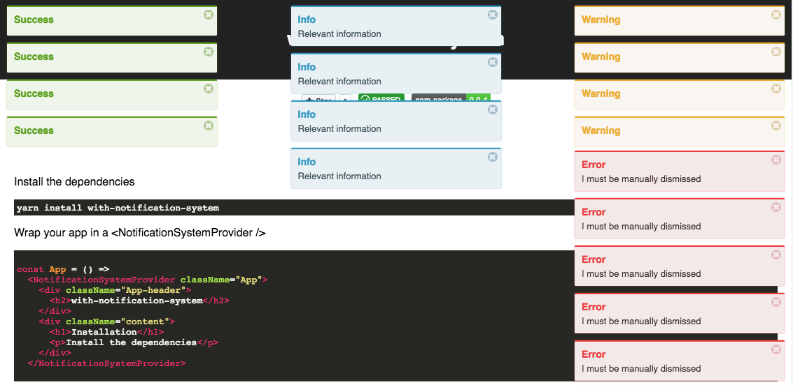

# with-notification-system

[](https://circleci.com/gh/Dean177/with-notification-system)

Provides [react-notification-system](https://github.com/igorprado/react-notification-system) as a [higher-order-component](https://facebook.github.io/react/docs/higher-order-components.html).

## Installation

`yarn add with-notifications-system`

## Usage



Check out the [live documentation](https://dean177.github.io/with-notification-system/) and the [example](https://github.com/Dean177/with-url-state/tree/master/example) directory

## Quick-start

Wrap your app in a `<NotificationSystemProvider />`
```javascript
// index.js
import { render } from 'react-dom';
import { withNotificationSystem } from 'with-notification-system';
import App from './App';

const rootElement = document.getElementById('root');

render(<NotificationSystemProvider><App /></NotificationSystemProvider>, rootElement);
```

Then anywhere you want a component to be able to create notifications
```javascript
// SuccessButton.js
import React from 'react';
import { withNotifications } from 'with-notification-system';

export class SuccessButton extends React.Component {
  handleClick = () =>
    this.props.notification.add({ title: 'Success 🎉' });

  render() {
    return <button onClick={this.handleClick}>Succeed</button>
  }
}

export default withNotificationSystem(SuccessButton)
```

## NotificationSystemProvider Props

| Name         | Type            | Default   | Description |
|------------  |---------------  |---------- |-----------  |
| className | `string or undefined` | 'NotificationSystemProvider' | Provide an alternate class to the wrapping div which gets created                                                                                                                                                  |
| noAnimation | boolean | false | Disable animations |
| style | object | - | provide inline styles to override all css |

## Notification options

Check out [react-notification-system](https://github.com/igorprado/react-notification-system/blob/master/README.md#creating-a-notification) for details on all of the options you can provide when creating a notification


## Motivation

`react-notification-system` is awesome but it uses the react [context system](https://reactjs.org/docs/context.html) which tightly couples components and results in components which create notifications. By using a higher-order-component we can hide that implementation detail and provide the notification system via props. That means testing is a cinch and you can avoid some boilerplate 🎉.
